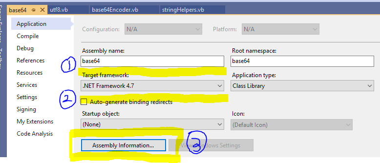
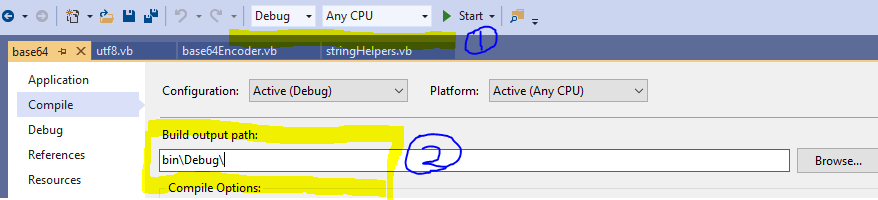

# Use Vanilla Compiler

## 1. Compile specific source file/project

```bash
# For compile a single source file
vanilla /path/to/file.vb [/out /path/to/out.wasm]

# For compile a complete vbproj 
vanilla /path/to/file.vbproj [/out /path/to/out.wasm]
```

### Usage note

1. For compile a single source file, you can specific the output file path by setting up ``/out`` option in the vanilla cli. if not this ``/out`` argument is presented, then the wasm assembly file will be generated at the same path as your input source file with the same file name but extension name is wasm.

2. For compile a standard vbproj file, you can specific the output file path by setting up ``/out`` option too. And also you can setting up the output file location in VisualStudio. By default the vanilla compiler is using the ``Release|AnyCPU`` config profile in your application project. But you can modify this profile by config the ``/profile`` cli option.

## 2. Step By Step Example


