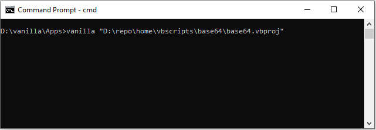
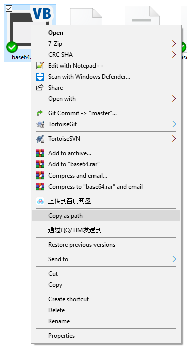

# Use Vanilla Compiler

<!-- 2019-04-23 -->

## 1. Compile specific source file/project

```bash
# For compile a single source file
vanilla "/path/to/file.vb" [/out "/path/to/out.wasm"]

# For compile a complete vbproj 
vanilla "/path/to/file.vbproj" [/out "/path/to/out.wasm"]
```

### Usage note

1. For compile a single source file, you can specific the output file path by setting up ``/out`` option in the vanilla cli. if not this ``/out`` argument is presented, then the wasm assembly file will be generated at the same path as your input source file with the same file name but extension name is wasm.

2. For compile a standard vbproj file, you can specific the output file path by setting up ``/out`` option too. And also you can setting up the output file location in VisualStudio. By default the vanilla compiler is using the ``Release|AnyCPU`` config profile in your application project. But you can modify this profile by config the ``/profile`` cli option.

## 2. Step By Step Example

### Setting up application properties


1. The assembly name property config value will renames the output WebAssembly file.
2. In order to used Linq in WebAssembly or some advanced custom attribute feature, you should target your vbproj at least .NET Framework 4.0
3. You also can edit assembly information for your WebAssembly application

### Setting up build output


Now switch to the **Compile** tab page, then 

1. you can switch the project profile for ``Debug|AnyCPU`` or ``Release|AnyCPU`` or others profile
2. Now you can config the WebAssembly output directory by **Browse** to the destination directory.

### Run compiler from CommandLine



Now open ``cmd``, (please makre sure you have add vanilla to your path environment).

1. type the compiler program name: ``vanilla``
2. and then type a whitespace, at last press ``<Shift>`` + Mouse right click on the vbproj file to copy full path, and then paste onto the command line input



3. Hit ``<Enter>``, job done.
